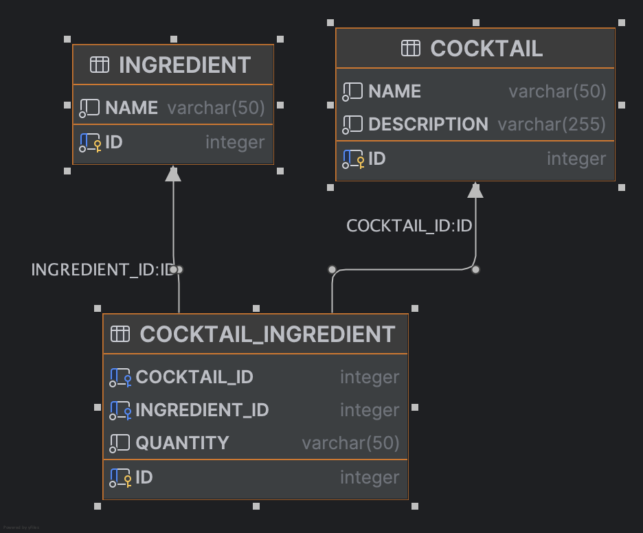

# 🍸 CocktailBar

A simple Spring Boot + H2DB application that simulates a small cocktail management system.

You can browse cocktail recipes, view ingredients and measurements, and perform CRUD operations on the cocktail catalog—all backed by an in-memory H2 database.

This reference project demonstrates a clean Controller → Repository layering, externalized SQL scripts (`schema.sql`, `data.sql`), and IntelliJ-friendly setup.  
Use it as the starting point for your IT Crafters Graduation Project.

---
# 📚 **Table of Contents**

- [Description](#description)
- [Prerequisites](#prerequisites)
- [Getting Started](#getting-started)
  - [Clone the Repository](#clone-the-repository)
  - [Build & Run (IntelliJ IDEA)](#build--run-intellij-idea)
- [Swagger UI](#swagger-ui)
- [Configuration](#configuration)
- [Database Initialization](#database-initialization)
- [Available Endpoints](#available-endpoints)
- [Project Structure](#project-structure)
- [Database Structure](#database-structure)
- [Use Case Ideas](#use-case-ideas)
- [License](#license)
- [Contributing](#contributing)

---

# 📖 Description

This example implements basic CRUD operations for a CocktailBar:

### MVP

- Find a cocktail by ID
- List all cocktails
- Add a cocktail
- Update a cocktail
- Delete a cocktail

You'll see how layers connect, how to externalize SQL scripts (`schema.sql`, `data.sql`), and how to work with an in-memory H2 database.

---

## 🛠 Prerequisites

- Java 17 or newer
- Gradle (or use the included `gradlew`)
- IntelliJ IDEA (optional, but recommended)

---

## 🚀 Getting Started

### Clone the Repository

#### Via IntelliJ IDEA

1. Open IntelliJ IDEA.
2. From the Welcome screen (or `File` menu), choose **Get from Version Control...**
3. Paste the repo URL (e.g. `https://github.com/your-org/cocktailbar.git`) into the URL field.
4. Select your local directory and click **Clone**.
5. Once opened, allow IntelliJ to import/reload the Gradle settings.

#### Via Command Line

```bash

git clone https://github.com/your-org/cocktailbar.git
cd cocktailbar

📑 Swagger UI

After startup, explore the API docs at:
🌐 http://localhost:8080/swagger-ui/index.html

⚙️ Configuration

All runtime settings are in:
src/main/resources/application.properties

🧰 Database Initialization

Spring Boot automatically loads the following files on startup:
schema.sql → Creates database tables and relationships
data.sql → Populates cocktails and ingredients
You can modify these to change initial data or structure.
schema.sql
Defines tables:
cocktail
ingredient
cocktail_ingredient (join table)
data.sql
Includes demo cocktails:
Margarita
Mojito
Cosmopolitan
Long Island Iced Tea
Screwdriver
...and common ingredients like:
Vodka
Rum
Tequila
Juice
Mint
More

📬 Available Endpoints

Method	Path	Description
GET	/api/cocktails	List all cocktails
GET	/api/cocktails/{id}	Retrieve cocktail by ID
POST	/api/cocktails	Create a new cocktail
PUT	/api/cocktails/{id}	Update existing cocktail
DELETE	/api/cocktails/{id}	Delete cocktail by ID
Example POST request:
{
  "name": "New Cocktail",
  "description": "A mix of vodka and cranberry juice"
}

🧱 Project Structure

cocktailbar/
├── src/
│   ├── main/
│   │   ├── java/
│   │   │   └── eu.itcrafters.cocktailbar/
│   │   │       ├── controller/        # REST endpoints
│   │   │       ├── persistence/       # Entities and repositories
│   │   │       └── CocktailbarApplication.java
│   │   └── resources/
│   │       ├── application.properties # Spring configuration
│   │       ├── schema.sql             # DDL statements
│   │       └── data.sql               # Sample data
│   └── test/
│       └── java/
│           └── eu.itcrafters.cocktailbar/
│               └── CocktailbarApplicationTests.java
├── build.gradle                       # Gradle build script
├── settings.gradle                    # Gradle settings
├── gradlew / gradlew.bat              # Gradle wrapper
├── .gitignore                         # Git ignore rules
├── .gitattributes                     # Git attributes
└── HELP.md                            # Spring references and links

🗺️ Database Structure

🧪 ER diagram 




💡 Use Case Ideas
Add IngredientController to manage ingredients
Build a React or Flutter frontend
Suggest cocktails based on available ingredients
Add user roles (bartender, admin, guest)
Export cocktail recipes as PDFs

📝 License

MIT (or insert your own license info)

🤝 Contributing

Pull requests are welcome!
Please open an issue first to discuss any major changes.
Happy mixing! 🍹